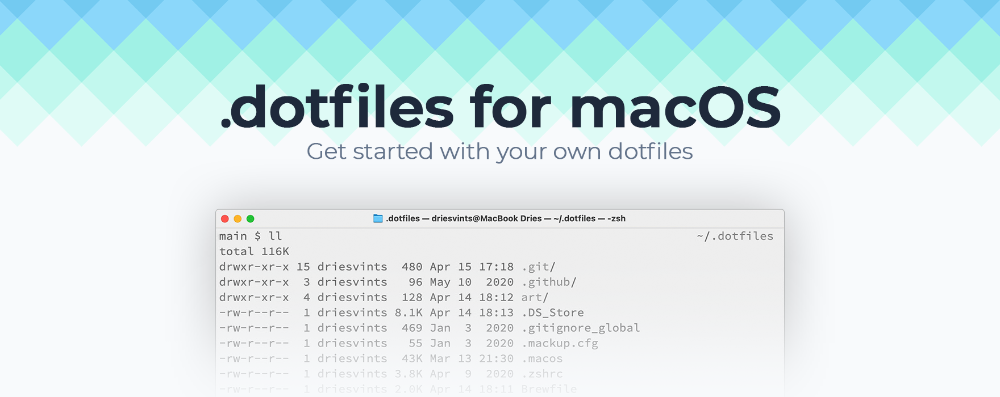

<p align="center"></p>

## Introduction

This repository serves as my way to help me setup and maintain my Mac. It takes the effort out of installing everything manually. Everything needed to install my preferred setup of macOS is detailed in this readme. Feel free to explore, learn and copy parts for your own dotfiles. Enjoy!

## A Fresh macOS Setup

These instructions are for setting up new Mac devices. Instead, if you want to get started building your own dotfiles, you can [find those instructions below](#your-own-dotfiles).

### Backup your data

If you're migrating from an existing Mac, you should first make sure to backup all of your existing data. Go through the checklist below to make sure you didn't forget anything before you migrate.

- Did you commit and push any changes/branches to your git repositories?
- Did you remember to save all important documents from non-iCloud directories?
- Did you save all of your work from apps which aren't synced through iCloud?
- Did you remember to export important data from your local database?
- Did you update [mackup](https://github.com/lra/mackup) to the latest version and ran `mackup backup`?

### Setting up your Mac

After backing up your old Mac you may now follow these install instructions to setup a new one.

1. Update macOS to the latest version through system preferences
2. [Generate a new public and private SSH key](https://docs.github.com/en/github/authenticating-to-github/generating-a-new-ssh-key-and-adding-it-to-the-ssh-agent) by running:

   ```zsh
   curl https://raw.githubusercontent.com/sarukomine/dotfiles/main/ssh.sh | sh -s "<your-email-address>"
   ```

3. Clone this repo to `~/.dotfiles` with:

   ```zsh
   git clone --recursive git@github.com:sarukomine/dotfiles.git ~/.dotfiles
   ```

4. Run the installation with:

   ```zsh
   ~/.dotfiles/fresh.sh
   ```

5. Restart your computer to finalize the process

Your Mac is now ready to use!

### Cleaning your old Mac (optionally)

After you've set up your new Mac you may want to wipe and clean install your old Mac. Follow [this article](https://support.apple.com/guide/mac-help/erase-and-reinstall-macos-mh27903/mac) to do that. Remember to [backup your data](#backup-your-data) first!

## Your Own Dotfiles

**Please note that the instructions below assume you already have set up Oh My Zsh so make sure to first [install Oh My Zsh](https://github.com/robbyrussell/oh-my-zsh#getting-started) before you continue.**

If you want to start with your own dotfiles from this setup, it's pretty easy to do so. First of all you'll need to fork this repo. After that you can tweak it the way you want.

Go through the [`.macos`](./.macos) file and adjust the settings to your liking. You can find much more settings at [the original script by Mathias Bynens](https://github.com/mathiasbynens/dotfiles/blob/master/.macos) and [Kevin Suttle's macOS Defaults project](https://github.com/kevinSuttle/MacOS-Defaults).

Check out the [`Brewfile`](./Brewfile) file and adjust the apps you want to install for your machine. Use [their search page](https://formulae.brew.sh/cask/) to check if the app you want to install is available.

When installing these dotfiles for the first time you'll need to backup all of your settings with Mackup. Install Mackup and backup your settings with the commands below. Your settings will be synced to iCloud so you can use them to sync between computers and reinstall them when reinstalling your Mac. If you want to save your settings to a different directory or different storage than iCloud, [checkout the documentation](https://github.com/lra/mackup/blob/master/doc/README.md#storage). Also make sure your `.zshrc` file is symlinked from your dotfiles repo to your home directory.

```zsh
brew install mackup
mackup backup
```

You can tweak the shell theme, the Oh My Zsh settings and much more. Go through the files in this repo and tweak everything to your liking.

Enjoy your own Dotfiles!
